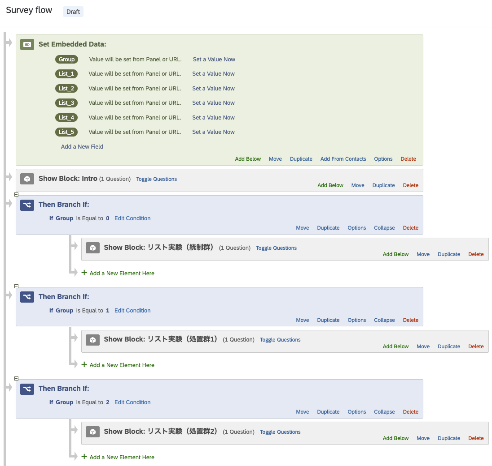
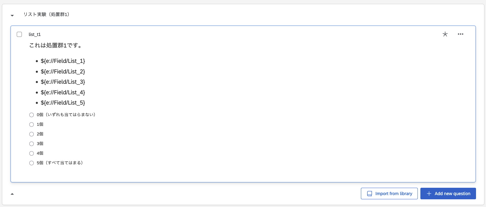

# Item randomizer for Qualtrics

- Qualtricsでリスト実験（list experiment / item count technique）を実装する際、項目をランダム化するスクリプトです。
- 宋が個人HPで公開した方法はphpスクリプトを利用する方法ですが、外部サーバーが必要でしたが、これはサーバー不要です。ただし、回答者の回答環境でJavaScriptが使える必要あります。
   - なによりQualtricsの仕様変更により、完全にJSONファイルをエクスポートしない場合、Web Serviceが使えなくなってしまい、既存のphpスクリプトは使えなくなりました...。

## 使い方

1. Survey Flowを開き、最上位にEmbedded Dataブロックを追加します。
   - フィールド名は`Group`とします（値は指定しません）。
   - 以下はオプション
      - `Group`だけでなく、さらに`List_1`、`List_2`、...というなのフィールドも追加します。
      - 統制群の項目数が3つなら、`List_4`まで、統制群の項目が4つなら`List_5`まで追加します。
      - つまり、処置群の項目数+1までフィールドを追加します。
      - この作業を行わなくても、問題なく動きます。項目がどのようにランダマイズされたか気にしない場合は`Group`のみでOKです（でも、こちらもやっておくのを推奨します）。
2. 最初の質問文（インフォームド・コンセントなど）に以下のJavaScriptをそのまま貼り付けます。
   - `controlArray`と`treatArray`の中身を適宜修正してください。その他の作業は不要です。

```js
Qualtrics.SurveyEngine.addOnload(function()
{
   /* 
      統制項目と処置項目の配列
      
      1. 統制群の項目はcontrolArray内に入力
         - 各項目は""で囲み、カンマ（,）で区切る
      2. 処置群の項目をtreatArray内に入力
         - 書き方は統制群と同じ
         - 処置群が2つの場合、["Sensitive Item 1", "Sensitive Item 2"]; のように書く
      3. Qualtricsの最初の質問文にこのJavaScriptを貼り付ける（内）
      4. Survey Flowの最初のブロックとしてEmbeded Dataを入れ、Group、List_1、List_2、...を入れる。
         - 統制項目の数 + 1まで。たとえば、統制項目が4個なら List_5 まで作成
   */
   var controlArray = ["Control Item 1", 
                       "Control Item 2", 
                       "Control Item 3", 
                       "Control Item 4"];
   var treatArray   = ["Sensitive Item 1"];

   // 以下からは修正しなくても良い
   var group = Math.floor(Math.random() * (treatArray.length + 1));

   if (group > 0) ListArray.push(treatArray[group - 1]);

   //console.log(ListArray) // デバッグ用

   for (let i = ListArray.length - 1; i > 0; i--) {
     const j = Math.floor(Math.random() * (i + 1));
     [ListArray[i], ListArray[j]] = [ListArray[j], ListArray[i]];
   }

   Qualtrics.SurveyEngine.setEmbeddedData("Group", group); // 本番用
   //console.log(group); // デバッグ用
   
   ListArray.forEach((value, index) => {
     Qualtrics.SurveyEngine.setEmbeddedData("List_" + (index + 1), value); // 本番用
     //console.log(value) // デバッグ用
   });

});

Qualtrics.SurveyEngine.addOnReady(function()
{
	/*Place your JavaScript here to run when the page is fully displayed*/

});

Qualtrics.SurveyEngine.addOnUnload(function()
{
	/*Place your JavaScript here to run when the page is unloaded*/

});
```

3. リスト実験の質問文を作成します。
   - 質問文は個別のブロックにしてください。つまり、統制群と処置群のみならブロックは2つ、処置群が2なら3つのブロックにそれぞれリスト実験の質問文を入れます。
   - ランダマイズされた項目は`${e://Field/List_1}`、`${e://Field/List_2}`、...で埋め込んでください。
4. 再びSurvey Flowに入り、リスト実験の分岐を作成してください。
   - Branchブロックで`Group`の値が`0`なら統制群のブロックが出現するようにします。
   - `Group`の値が`1`なら処置群1、`2`なら処置群2のブロックを割り当てます。
      - JavaScriptの`treatArray`配列の中身の順番が処置群の番号となります。

## 例

### Survey Flow



### 設問



## サンプル

- 以上のやり方でリスト実験を実装した質問票を作成しました。
- `qualtrics_item_randomizer.qsf`をダウンロードし、Qualtricsで読み込んでください。
- SurveyFlowの作り方、質問文の作り方の参考として使ってください。

 
